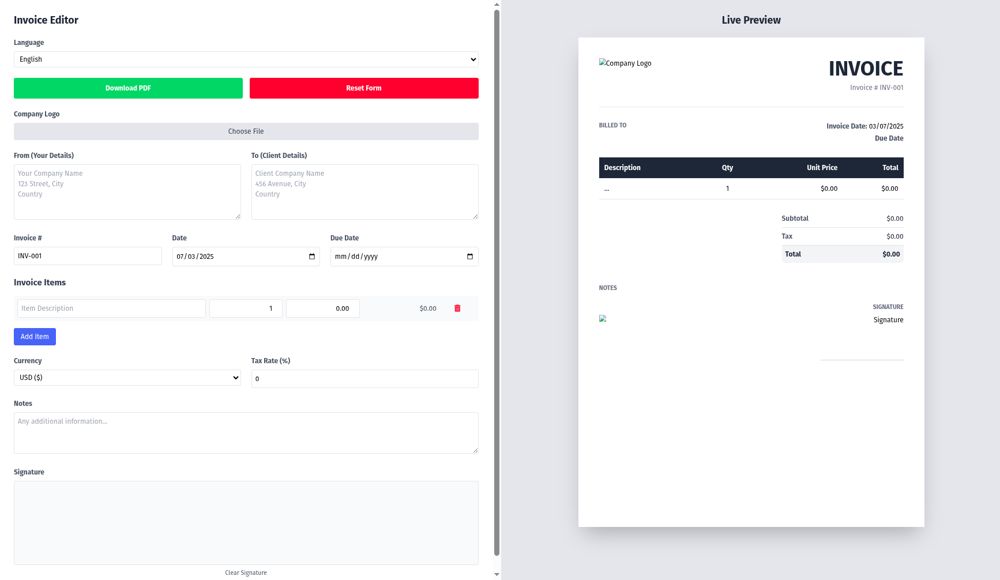

# PDF Invoice Online Editor

A powerful, client-side PDF invoice generator built with HTML, Tailwind CSS, and vanilla JavaScript. This tool provides a seamless two-pane interface for editing invoice details on the left and viewing a real-time, professional preview on the right.

**[➡️ Live Demo](https://anas1412.github.io/pdf-invoice-online-editor/)**



---

## ✨ Features

-   **Two-Pane Live Preview:** Edit on the left, see your changes instantly on the right in a clean, professional invoice template.
-   **Lightweight PDF Generation:** Download your final invoice as a high-quality, vector-based, and text-selectable PDF with a tiny file size (typically < 100KB).
-   **Dynamic Items Table:** Easily add, edit, or remove line items. Totals are calculated automatically.
-   **Automatic Calculations:** Subtotal, tax, and grand total are calculated in real-time.
-   **Multi-Language Support:** Switch between English and French with a single click.
-   **Multi-Currency Support:** Choose from several currencies (USD, EUR, GBP, TND), with the correct symbol applied automatically.
-   **Customizable Content:**
    -   **Company Logo:** Upload your company logo and toggle its visibility.
    -   **Signature:** Add a digital signature and toggle its visibility.
    -   **Payment Terms:** Add payment terms (e.g., "Net 30") and toggle their visibility.
-   **Professional Date Picker:** A clean, consistent date picker for all date fields.
-   **Fully Client-Side:** No data ever leaves your browser. Everything is processed locally for maximum privacy.
-   **Responsive Design:** The editor is fully usable on different screen sizes.

## 🛠️ Tech Stack

-   **Frontend:**
    -   **HTML5:** For the core structure.
    -   **[Tailwind CSS](https://tailwindcss.com/):** For all styling, included via the official CDN for simplicity.
    -   **[Vanilla JavaScript](https://developer.mozilla.org/en-US/docs/Web/JavaScript):** For all client-side logic and interactivity.
-   **Libraries (via CDN):**
    -   **[jsPDF](https://github.com/parallax/jsPDF) & [jsPDF-AutoTable](https://github.com/simonbengtsson/jsPDF-AutoTable):** For generating the final vector-based PDF document.
    -   **[Signature Pad](https://github.com/szimek/signature_pad):** For the digital signature functionality.
    -   **[Flatpickr](https://flatpickr.js.org/):** For the professional date picker.
    -   **[Font Awesome](https://fontawesome.com/):** For icons.

## 🚀 Getting Started

This project uses no build tools or package managers. You can run it by simply opening the `index.html` file in your web browser.

1.  **Clone the repository:**
    ```bash
    git clone https://github.com/anas1412/pdf-invoice-online-editor.git
    ```
2.  **Navigate to the project directory:**
    ```bash
    cd pdf-invoice-online-editor
    ```
3.  **Open `index.html`:**
    -   **On Linux/macOS:**
        ```bash
        open index.html
        ```
    -   **On Windows:**
        ```bash
        start index.html
        ```
    -   Or, simply double-click the file in your file explorer.

## 🤝 Contributing

Contributions, issues, and feature requests are welcome! Feel free to check the [issues page](https://github.com/anas1412/pdf-invoice-online-editor/issues).

## 📝 License

This project is licensed under the MIT License.